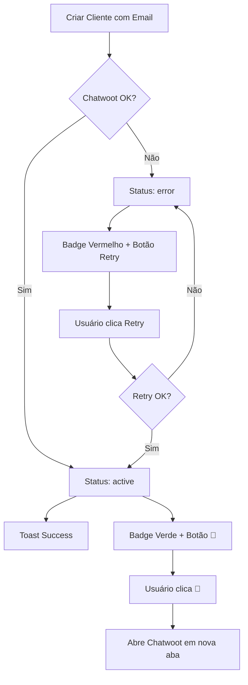

# Features Adicionais do Chatwoot - Implementação Completa

## 📋 Resumo
Implementação de 3 features adicionais para melhorar a experiência do usuário com o Chatwoot:

1. ✅ **Botão "Tentar Novamente"** quando status = 'error'
2. ✅ **Botão "Abrir Painel Chatwoot"** direto no card
3. ✅ **Toast notification** ao provisionar com sucesso

---

## 🎯 Features Implementadas

### 1. Botão "Tentar Novamente" (Retry)

**Onde aparece**: No card do cliente, ao lado do badge "✗ Chatwoot" quando status = 'error'

**Como funciona**:
- Botão circular com ícone `RefreshCw`
- Cores vermelhas combinando com o badge de erro
- Chama o endpoint `/api/clientes/[id]/chatwoot-retry` (POST)
- Mostra loading durante a tentativa
- Exibe toast de sucesso ou erro
- Recarrega a página automaticamente após sucesso

**Arquivos modificados**:
- `components/clientes/cliente-card.tsx` (linhas 270-284)
- `app/api/clientes/[id]/chatwoot-retry/route.ts` (NOVO arquivo)

---

### 2. Botão "Abrir Painel Chatwoot"

**Onde aparece**: No card do cliente, ao lado do badge "✓ Chatwoot" quando status = 'active'

**Como funciona**:
- Botão circular com ícone `MessagesSquare`
- Cores verdes combinando com o badge de ativo
- Abre o painel do Chatwoot em nova aba
- URL: `{CHATWOOT_BASE_URL}/app/login`

**Arquivos modificados**:
- `components/clientes/cliente-card.tsx` (linhas 286-296)

**Comportamento visual**:
```
┌─────────────┬───────┬───────┐
│ ✓ Chatwoot  │  💬   │       │  ← Badge + Botão de acesso direto
└─────────────┴───────┴───────┘
```

---

### 3. Toast Notification ao Provisionar

**Quando aparece**:
- Na criação de cliente com email
- No retry bem-sucedido do Chatwoot

**Como funciona**:
- Usa o sistema de toast já existente (`components/ui/toast.tsx`)
- Mensagem: "🎉 Chatwoot provisionado com sucesso!"
- Toast verde (success)
- Auto-dismiss após 5 segundos

**Arquivos modificados**:
- `app/dashboard/clientes/novo/page.tsx` (linhas 120-124)
- `components/clientes/cliente-card.tsx` (linha 161)

---

## 📁 Arquivos Criados

### 1. `/app/api/clientes/[id]/chatwoot-retry/route.ts`

**Função**: Endpoint para retentar provisionamento do Chatwoot

**Fluxo**:
1. Autentica usuário
2. Busca cliente no banco
3. Valida se tem email cadastrado
4. Atualiza status para 'pending'
5. Chama `chatwootService.provisionComplete()`
6. Salva resultado no banco (active ou error)
7. Cria log de evento
8. Retorna resposta JSON

**Resposta de sucesso**:
```json
{
  "success": true,
  "message": "Chatwoot provisionado com sucesso!",
  "data": {
    "account_id": 123,
    "inbox_id": 456,
    "user_email": "email@example.com"
  }
}
```

**Resposta de erro**:
```json
{
  "success": false,
  "error": "Erro ao provisionar Chatwoot",
  "message": "create_inbox: Connection timeout"
}
```

---

## 📝 Arquivos Modificados

### 1. `components/clientes/cliente-card.tsx`

**Imports adicionados**:
```typescript
import { useToast } from '@/components/ui/toast';
import { RefreshCw, MessagesSquare } from 'lucide-react';
```

**States adicionados**:
```typescript
const [isRetryingChatwoot, setIsRetryingChatwoot] = useState(false);
```

**Handlers adicionados**:
```typescript
const handleRetryChatwoot = async () => { ... }
const handleOpenChatwoot = () => { ... }
```

**UI modificada**:
- Badge do Chatwoot agora está dentro de um `<div>` flex
- Botão de retry aparece quando `chatwoot_status === 'error'`
- Botão de acesso direto aparece quando `chatwoot_status === 'active'`

**Estrutura visual**:
```jsx
<div className="flex items-center gap-2">
  {/* Badge de Status */}
  <button>✓ Chatwoot</button>

  {/* Botão de Retry (só quando error) */}
  {status === 'error' && <button><RefreshCw /></button>}

  {/* Botão de Acesso Direto (só quando active) */}
  {status === 'active' && <button><MessagesSquare /></button>}
</div>
```

---

### 2. `app/dashboard/clientes/novo/page.tsx`

**Código adicionado** (após criar cliente):
```typescript
// ✅ Notificar provisionamento do Chatwoot
if (data.chatwoot?.provisioned) {
  toast.success('🎉 Chatwoot provisionado com sucesso!');
  console.log('🎉 Chatwoot provisionado:', data.chatwoot);
}
```

**Loading message modificado**:
```tsx
<ul className="list-disc list-inside mt-2 space-y-1">
  <li>Criando cliente no banco de dados</li>
  {formData.email && <li>Provisionando Chatwoot (Account, User, Inbox)</li>}
  <li>Criando instância WhatsApp na UAZAPI</li>
  <li>Configurando webhooks</li>
</ul>
```

---

## 🎨 Design e UX

### Estados do Badge Chatwoot

| Status    | Cor          | Ícone | Ações Disponíveis              |
|-----------|--------------|-------|--------------------------------|
| `active`  | Verde        | ✓     | Ver credenciais, Abrir painel |
| `pending` | Amarelo      | ⟳     | Nenhuma (aguardar)            |
| `error`   | Vermelho     | ✗     | Tentar novamente              |

### Botões de Ação

| Botão           | Ícone          | Cor    | Tooltip                      |
|-----------------|----------------|--------|------------------------------|
| Retry           | RefreshCw      | Red    | "Tentar provisionar novamente" |
| Abrir Chatwoot  | MessagesSquare | Green  | "Abrir painel do Chatwoot"   |

---

## 🧪 Como Testar

### 1. Testar Toast de Sucesso

1. Criar novo cliente com email válido
2. Aguardar criação
3. Verificar toast verde: "🎉 Chatwoot provisionado com sucesso!"

### 2. Testar Botão de Retry

**Simular erro**:
1. Desligar/pausar servidor Chatwoot temporariamente
2. Criar cliente com email (vai falhar)
3. Ver badge vermelho "✗ Chatwoot"
4. Ver botão de retry ao lado
5. Religar servidor Chatwoot
6. Clicar no botão de retry
7. Aguardar provisionamento
8. Ver toast de sucesso
9. Ver badge mudar para "✓ Chatwoot"

### 3. Testar Botão de Acesso Direto

1. Localizar cliente com Chatwoot ativo
2. Ver botão 💬 ao lado do badge verde
3. Clicar no botão
4. Verificar que abre nova aba com painel do Chatwoot

---

## 🔍 Logs e Debug

### Console Logs Importantes

**Retry bem-sucedido**:
```
🔄 [CHATWOOT-RETRY] Retentativa para cliente: abc-123
🚀 [CHATWOOT-RETRY] Iniciando retentativa de provisionamento...
✅ [CHATWOOT-RETRY] Provisionamento concluído com sucesso!
```

**Retry com erro**:
```
🔄 [CHATWOOT-RETRY] Retentativa para cliente: abc-123
🚀 [CHATWOOT-RETRY] Iniciando retentativa de provisionamento...
❌ [CHATWOOT-RETRY] Falha no provisionamento: { step: 'create_inbox', error: '...' }
```

---

## 📊 Fluxo Completo



---

## ✅ Checklist de Implementação

- [x] Endpoint `/api/clientes/[id]/chatwoot-retry` criado
- [x] Handler `handleRetryChatwoot` implementado
- [x] Handler `handleOpenChatwoot` implementado
- [x] Botão de retry com loading state
- [x] Botão de acesso direto ao Chatwoot
- [x] Toast notification na criação
- [x] Toast notification no retry
- [x] Mensagem de loading atualizada
- [x] Imports e ícones adicionados
- [x] States gerenciados corretamente
- [x] Logs detalhados no backend
- [x] Tratamento de erros
- [x] Reload automático após sucesso

---

## 🚀 Próximos Passos (Opcional)

1. **Adicionar analytics**: Rastrear quantas tentativas de retry são feitas
2. **Limitar retries**: Máximo de 3 tentativas automáticas
3. **Webhook de notificação**: Notificar admin quando provisionar
4. **Melhorar mensagem de erro**: Mostrar dicas específicas baseadas no step que falhou
5. **Dashboard de status**: Painel com estatísticas de provisionamento

---

## 📚 Documentação Relacionada

- [IMPLEMENTACAO_CHATWOOT.md](./IMPLEMENTACAO_CHATWOOT.md) - Implementação base do Chatwoot
- [lib/services/chatwoot.service.ts](./lib/services/chatwoot.service.ts) - Serviço do Chatwoot
- [components/ui/toast.tsx](./components/ui/toast.tsx) - Sistema de toast
